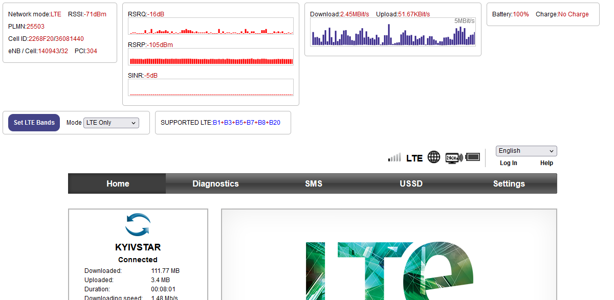
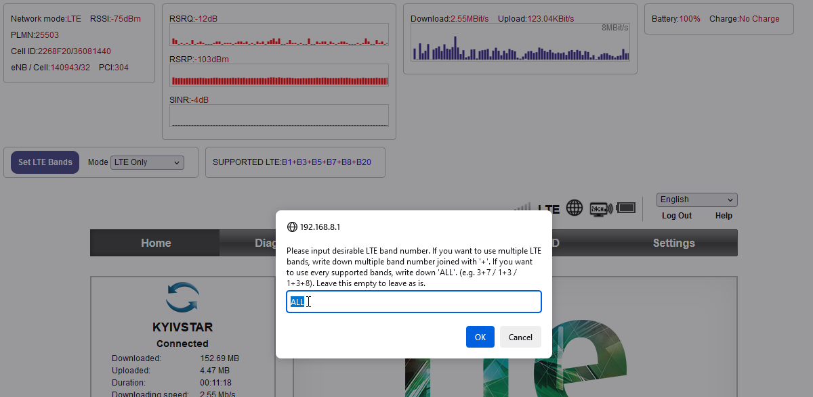
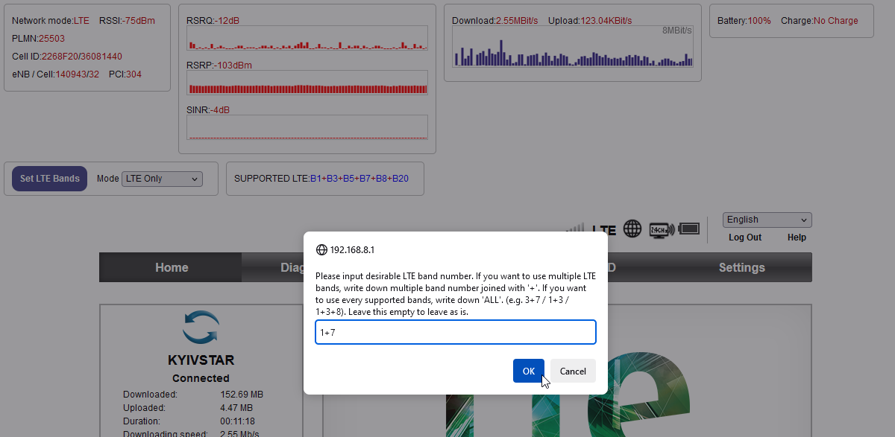
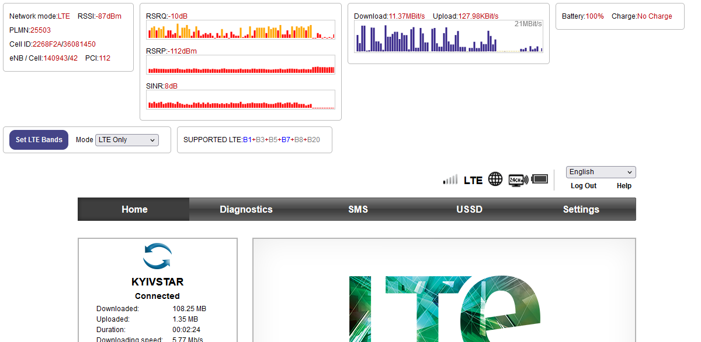
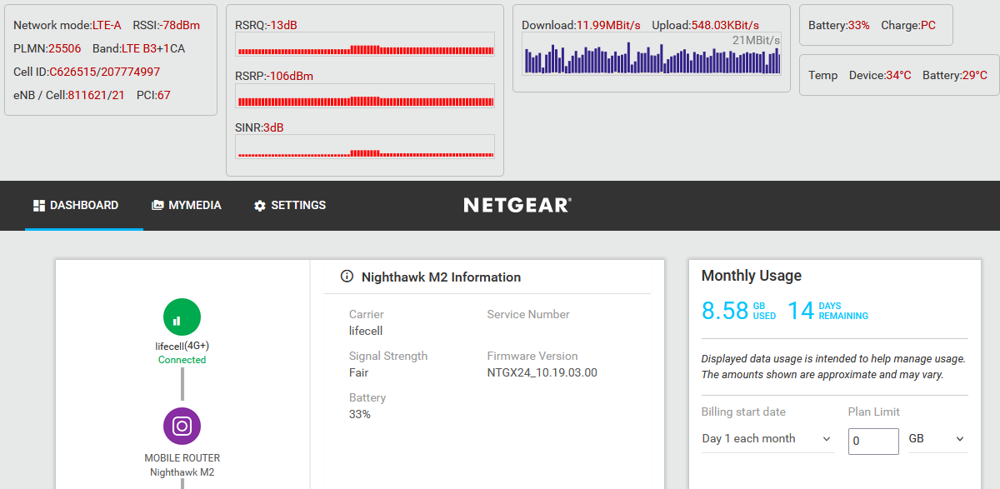

# Mobile Router Dashboard

This repository contains JavaScript code that show dashboard with mobile connection parameters that are not always available in the Web UI of Huawei&Netgear routers. There are two versions of the script:
* as a URL code for a browser **Bookmark**
* as a [TamperMonkey addon](https://www.tampermonkey.net/)

Currently the extra dashboard shows the following data:
* network type (GSM, WCDMA, LTE)
* signal strength parameters specific to current network type (e.g. EC/IO for 3G, SINR for LTE)
* DL/UL rates

Additionally, dashboard for the Huawei routers allows fixation of LTE bands.

## Screenshots

### Huawei version

Dashboard with bar plot of signal history:



Specifying LTE bands:



Example setup of B1+B7 with LTE only:



Now active inactive bands are greyed out in the dashboard:



E8372, LTE USB modem:


Dashboard on E5330As-2. LTE band selection is not available for 3g-only mobile router:


### Netgear version

Dashboard with history and download/upload rate:



## Installation & Usage

### Bookmark version

* Create new bookmark in a browser
* Copy the code from [ExtraAntennaStatus.min.js](ExtraAntennaStatus.min.js) for Huawei router or [NetgearEAS.min.js](NetgearEAS.min.js) for Netgear router
* Insert the code as new bookmark URL
* Navigate to mobile WiFi page and execute the bookmark. **Note: Changing of LTE bands on Huawei routers works only after logging into Web UI of the router.**

### TamperMonkey addon version

* Install TamperMonkey addon to your browser (available on Chrome, Firefox, Firefox Mobile, etc) - https://www.tampermonkey.net/
* Create new user script and copy the contents of the [ExtraAntennaStatus.js](ExtraAntennaStatus.js) for Huawei router or [NetgearEAS.js](NetgearEAS.js) for Netgear router file
* Update `@match` tag to web dashboard address of the modem. One can specify several `@match` in case there are several adresses, i.e.:

```
@match        http://192.168.8.1/*
@match        http://192.168.9.1/*
```

* Navigate to web dashboard page of the router. Some routers may require login to aquire all information.

## Supported devices

The script was tested on the following routers:

### Huawei

* E5330As-2
* E5573s-320
* E8372h-608

### Netgear

* Nighthawk M2 (MR2100)

## Tested on

### Bookmark version

* Safari on iOS 16.6
* Firefox 116
  * Ubuntu 23.04
  * Windows 10
* MS Edge 116 on Windows 10

### Addon Version

Tested with TamperMonkey 4.19

* Firefox 116 on Android 13
* Firefox 116
  * Ubuntu 23.04
  * Windows 10
* MS Edge 116 on Windows 10

## TODO

* [x] Safer XML parser
* [x] LTE Band selector. It is possible to specify LTE bands, but without non-standard firmware it is impossible to check what LTE band is actually in use or what are the EARFCN frequency codes.
* [ ] Adjust refresh rate. Now it is handled by `UPDATE_MS` variable in the script.

## Acknowledgments

* LTE band selector by [@ECOFRI](https://github.com/ECOFRI) - https://github.com/ECOFRI/HuaweiLTEBandSelector/
* Additional dashboard by [MioNonno](https://www.youtube.com/@miononno) - https://miononno.it/files/HUAWEI/latest/
