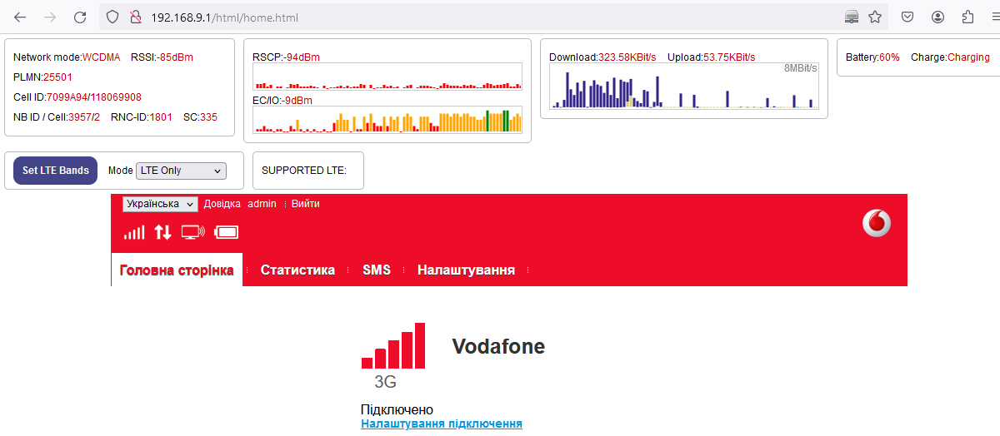
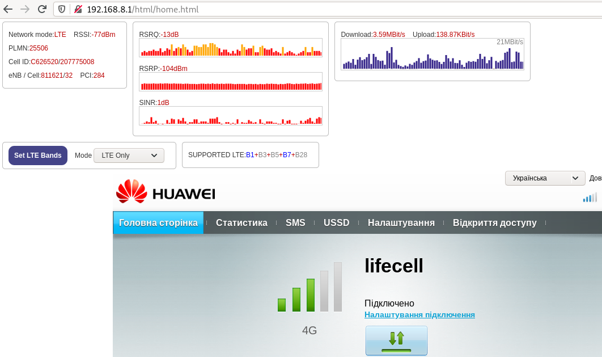

# Huawei Mobile Dashboard

This repository contains js script for [TamperMonkey addon](https://www.tampermonkey.net/) that show dashboard with mobile connection parameters that are not always available in the Web UI of Huawei routers.

Currently the extra dashboard shows the following data:
* network type (GSM, WCDMA, LTE)
* signal strength specific to current (e.g. EC/Io for 3G, SINR for LTE)
* DL/UL bandwidth on the web dashboard of Huawei routers

## Screenshots






## Usage

* Install TamperMonkey addon to your browser (available on Chrome, Firefox, Firefox Mobile, etc) - https://www.tampermonkey.net/
* Create new user script and copy the contents of the `ExtraAntennaStatus.js` file
* Update `@match` tag to web dashboard address of the modem. One can specify several `@match` in case there are several adresses, i.e.:

```
@match        http://192.168.8.1/*
@match        http://192.168.9.1/*
```

* Navigate to web dashboard page of the router. Some routers may require login to aquire all information.

## Supported devices

The script was tested on the following routers:

* E5330
* E5573s-320
* E8372h-608

## TODO

* [ ] Safer XML parser
* [ ] LTE Band selector (it is possible to specify LTE bands, but without non-standard firmware it is impossible to check what LTE band is actually in use or what are the EARFCN frequency codes).
* [ ] Adjust refresh rate (now it is handled by `UPDATE_MS` variable in the script)

## Acknowledgments

* LTE band selector by [@ECOFRI](https://github.com/ECOFRI) - https://github.com/ECOFRI/HuaweiLTEBandSelector/
* Additional dashboard by [MioNonno](https://www.youtube.com/@miononno) - https://miononno.it/files/HUAWEI/latest/
